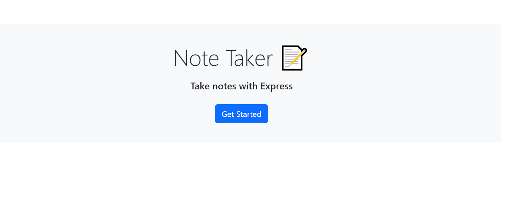
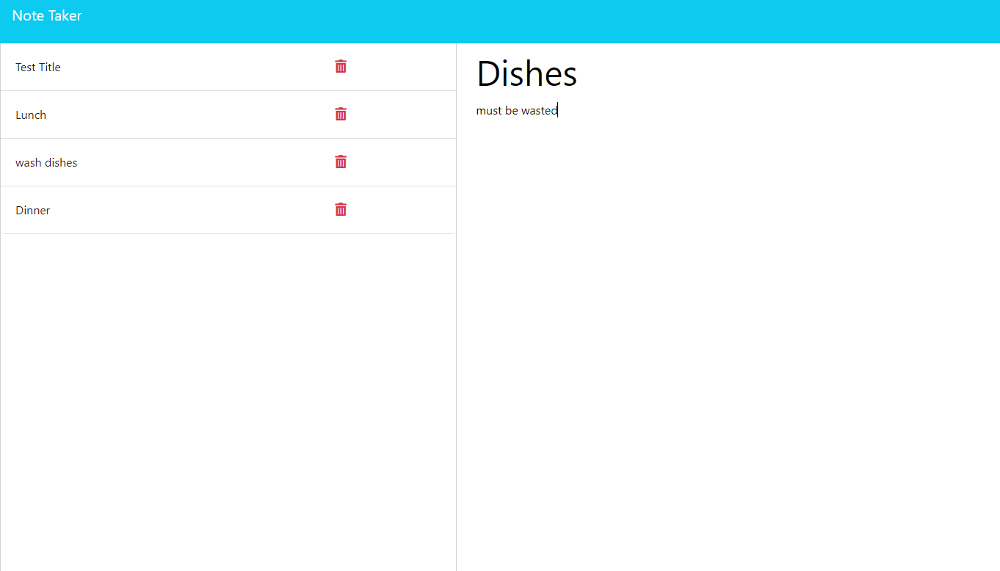

# Note Taker

## Description

Provide a short description explaining the what, why, and how of your project. Use the following questions as a guide:

This project was to create the routes for the html and api routes.  The starter code was a little confusing at the start but once I realized the routes and server.js were missing it was clear what needed to be written.  The biggest challenge was reading the existing code.  It took multiple read throughs and referencing other assignments to understand the pre-existing code. 

I learned more about the consistancy of backend coding.  Since what I needed to write was very similar to code used during the class sessions. I'm eager to learn and write more backend code.

## Table of Contents (Optional)

If your README is long, add a table of contents to make it easy for users to find what they need.

- [Installation](#installation)
- [Usage](#usage)
- [Credits](#credits)
- [License](#license)

## Installation

No steps needed to install this project.  Please use the weblink to experience the project at:

https://notetake-dm-1e86babf485a.herokuapp.com/

## Usage

Click the blue "get started" button.

Once there you can click on "Note Title" to enter the title of your note and write a description below it.  Once you have finished writing it please click the "Save Note" button in the top right corner.

You can also click the titles of previous notes to recall them.

## Credits

Phillip Loy (tutor)

## License
MIT

